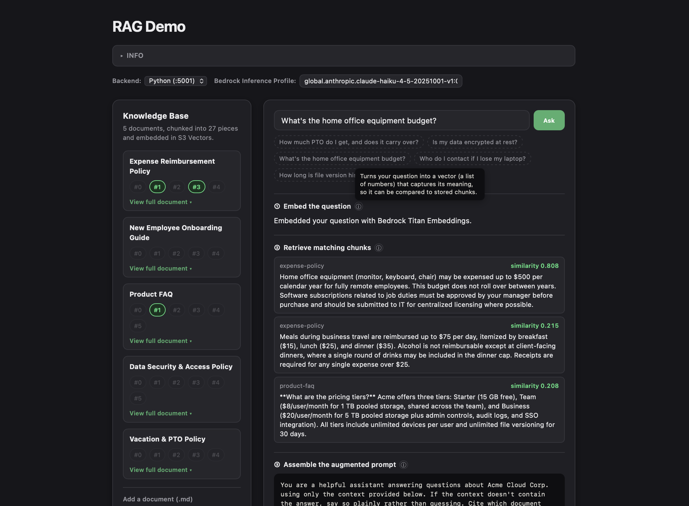

# Retrieval-Augmented Generation Demo



A runnable demonstration of how RAG actually works: a real AWS backend that chunks and
embeds documents, retrieves the most relevant pieces for a question, and asks an LLM to
answer using only that retrieved context — plus an interactive dashboard (served by both
a Python and a Node.js implementation) that visualizes every stage of the pipeline live.

The knowledge base is a small fictional corpus for "Acme Cloud Corp.", a made-up cloud
storage company, so answers are checkable against a known, readable source.

## What is RAG?

Retrieval-Augmented Generation grounds an LLM's answers in your own data instead of
relying only on what it memorized during training. Instead of asking the model a
question directly, you first **retrieve** the most relevant pieces of your knowledge
base (via similarity search over embeddings), then **augment** the prompt with that
retrieved context, and only then ask the model to **generate** an answer. This makes
answers checkable against a real source and lets the model say "I don't know" instead
of confidently guessing when the knowledge base doesn't cover something.

## Architecture

```
Ingest (S3-triggered, automatic):
  infra/docs/*.md --sync--> S3 docs bucket --ObjectCreated--> ingest Lambda
      --> chunk into paragraphs --> Bedrock Titan Embeddings (concurrent) --> S3 Vectors index

Upload (from the dashboard, any time):
  Browser --> local demo app --> POST /upload (API Gateway) --> upload Lambda
      --> writes the file into the S3 docs bucket --> triggers the same ingest path above

Corpus (what's actually indexed right now):
  Browser --> local demo app --> GET /corpus (API Gateway) --> corpus Lambda
      --> lists every chunk currently in the S3 Vectors index, grouped by document,
          plus the deployed default generation model id

View a document (full source, not just chunk previews):
  Browser --> local demo app --> GET /document?doc_id=X (API Gateway) --> document Lambda
      --> reads docs/X.md straight from the S3 docs bucket and returns it as-is

Query (every question):
  Browser --> local demo app (python/app.py or node/server.js) --> POST /ask (API Gateway)
      --> ask Lambda:
            1. Bedrock Titan Embeddings (embed the question)
            2. S3 Vectors QueryVectors (k-NN search -> top-k chunks)
            3. Build an augmented prompt (context + question)
            4. Bedrock InvokeModel (a Claude model) -> grounded answer
      <-- { answer, sources, prompt, model_id } JSON
  <-- demo app forwards the JSON as-is; the browser animates the pipeline stage by stage
```

Both embeddings and generation run on **Amazon Bedrock** — there's no local AI call at
all. The local Python and Node servers are thin: they serve the shared dashboard and
proxy JSON endpoints to AWS (`/api/ask`, `/api/upload`, `/api/corpus`, `/api/document`),
attaching the shared API key automatically. This lets you run and compare both language
implementations against the exact same backend.

Every HTTP-facing Lambda (`ask`, `upload`, `corpus`, `document` — not `ingest`, which is
S3-triggered, not HTTP-triggered) shares one small `infra/src/common.py` module for
request authorization and body parsing, bundled into the same deployment zip.

## Prerequisites

- An AWS account with credentials configured (`aws configure` or SSO).
- **Bedrock model access enabled** for two models, in whichever region you deploy to
  (AWS Console → Bedrock → Model access — this is a one-time, per-region opt-in):
  - `amazon.titan-embed-text-v2:0` (embeddings)
  - A Claude model of your choice (generation) — check which Claude models are enabled
    for your account/region and copy its exact model id; you'll pass it to `deploy.py`.
    Note: Anthropic models are distributed via AWS Marketplace even when invoked through
    Bedrock, so the _first_ `InvokeModel` call for a given model auto-subscribes your
    account — this can take up to a couple of minutes the very first time.
- Python 3.9+ (for the backend Lambdas, `deploy.py`, and the Python demo app).
- Node.js 18+ (for the Node demo app — needs built-in `fetch`).
- The AWS CLI, for seeding the corpus (`aws s3 sync`).

## Deploy the AWS backend

`deploy.py`/`destroy.py` need `boto3` (just for local use of the same SDK version - the
Lambda runtime already includes it). `source activate.sh` creates a virtual environment
in `infra/.venv` on first run and activates it in your current shell — run it again in
any new terminal session to reactivate. It must be _sourced_, not executed:

```bash
cd infra
source activate.sh
python3 deploy.py --gen-model-id <your-claude-model-id>
```

(The Python demo app in `python/` is stdlib-only and never needs this venv — only
`infra/` depends on boto3.)

`--gen-model-id` and `--api-key` can also be set via the `GEN_MODEL_ID` and `API_KEY`
environment variables instead of flags (a flag, if given, takes precedence) — handy if
you redeploy often and don't want to retype the model id each time:

```bash
export GEN_MODEL_ID=<your-claude-model-id>
python3 deploy.py
```

Or put them in `infra/.env` (copy `infra/.env.example`) and skip the `export` entirely —
`deploy.py` loads it automatically, the same way the demo servers load their own `.env`.

This provisions (see `deploy.py` — it's plain boto3, every API call is visible, no
CloudFormation/Serverless Framework/CDK): an S3 bucket for documents, an S3 Vectors
bucket + index for embeddings, five Lambda functions (`ingest`, `ask`, `upload`,
`corpus`, `document`), and an API Gateway HTTP API exposing `POST /ask`,
`POST /upload`, `GET /corpus`, and `GET /document`. It's idempotent — safe to re-run.

### API key

Every route (except the S3-triggered `ingest`) requires a shared-secret `X-API-Key`
header, checked with a constant-time comparison — enough to stop a stranger who finds
your API URL from running up your Bedrock bill. `deploy.py` handles it for you:

- **First deploy**: no `--api-key` needed — it generates a random one and prints it.
- **Later deploys**: omit `--api-key` again and it reuses whatever's already deployed,
  so your `.env` files keep working. Pass `--api-key <value>` only if you deliberately
  want to set or rotate it.

At the end it prints your API base URL and the key. Seed the knowledge base with the
starter corpus:

```bash
aws s3 sync docs s3://<bucket-name-from-output>/docs
```

Each file triggers the `ingest` Lambda automatically. Give it a few seconds, then you're
ready to query. (You can add more documents later from the dashboard itself — see
"Adding your own documents" below.)

## Run the demo app

First, set `API_URL` and `API_KEY` for both (same values, from `deploy.py`'s output):

```bash
cp python/.env.example python/.env   # then edit API_URL and API_KEY
cp node/.env.example node/.env       # then edit API_URL and API_KEY
```

Then start both at once:

```bash
./run.sh
```

This runs the Python server on `:5001` and the Node server on `:5002` together and
prints both URLs. Open either one — the dashboard has a **Backend** selector at the top
that switches which server actually handles `/api/*` calls, live, without reloading the
page, so you can confirm both language implementations behave identically. Ctrl+C stops
both. (You can still run just one on its own with `python3 app.py` / `node server.js`.)

On the dashboard: type a question (or click one of the sample chips) and watch the
pipeline animate — embed → retrieve (with the matching chunks highlighted in the
knowledge-base panel, similarity scores and all) → the exact assembled prompt → the
generated answer. The **Model** field lets you try a different Bedrock Claude model
per-question without redeploying (falls back to whatever `--gen-model-id` you deployed
with if left unchanged). Click **"View full document"** under any document card to see
its complete original source. Use **"Add a document"** to upload something new (`.md`
only) and ask about it right away.

### Adding your own documents

The knowledge-base panel's upload control writes a `.md` file straight into the S3 docs
bucket via the `upload` Lambda — the same `ingest` pipeline that seeds the initial corpus
picks it up automatically (no separate code path), and the dashboard polls `/corpus`
until the new document shows up as indexed, usually within a few seconds.

You can also add documents in bulk without the UI:

```bash
aws s3 cp my-new-doc.md s3://<bucket-name>/docs/
```

## Evaluating the backend

`infra/eval.py` runs a fixed set of questions against the deployed `/ask` endpoint and
checks two things per question: **retrieval** (did the expected document show up in the
returned sources?) and **groundedness** (does the answer contain the fact it should, or,
for questions with no answer in the corpus, does the model actually decline instead of
guessing?). It's stdlib-only, reads `API_URL`/`API_KEY` the same way the demo servers do,
and needs the starter corpus already seeded:

```bash
cd infra
python3 eval.py
```

## Cost & cleanup

Every piece here — S3, Lambda, API Gateway, Bedrock invocations, and S3 Vectors itself —
is pay-per-use with no idle compute floor, so a test run plus several demo sessions
should cost a few dollars at most. When you're done:

```bash
cd infra
python3 destroy.py
```

This tears down everything `deploy.py` created, in reverse order.

---

## Implementation, security & optimization notes

A few deliberate choices worth understanding if you're reading this as a reference, not
just running it.

### Implementation

- **Chunking** is a simple paragraph split (`re.split(r"\n\s*\n", text)`), one embedding
  per paragraph. Real systems often use semantic or sliding-window chunking tuned to the
  embedding model and document structure — this is the simplest thing that makes
  retrieval quality visible and checkable in a demo.
- **`ingest.py` embeds a document's chunks concurrently** (`ThreadPoolExecutor`), not one
  at a time in a loop. `Bedrock InvokeModel` calls are independent, I/O-bound network
  round trips, so this cuts both indexing latency and the Lambda's billed duration
  roughly by a factor of however many chunks run in parallel.
- **One shared vector index** for all documents, no multi-tenancy. A real system serving
  multiple customers would need per-tenant indices or metadata-based access control.
- **`eval.py` checks facts with substring matching, not an LLM judge.** Each question has
  an expected doc id and either a keyword the answer should contain or (for out-of-scope
  questions) a refusal-phrase list it should match instead. That's deterministic, free,
  and matches the project's no-extra-deps style, but it's brittle to paraphrasing — a
  correct answer worded differently can fail the check. An LLM-as-judge would be more
  robust to phrasing but adds cost, latency, and nondeterminism of its own.
- **Re-uploading a document with the same filename** re-embeds and overwrites its
  existing chunks by position (`doc_id#0`, `doc_id#1`, ...). If the new version has
  _fewer_ paragraphs than before, the extra old chunks are left orphaned in the index
  rather than cleaned up — a real system would reconcile or version documents properly.
- **No retry/backoff** on Bedrock calls, and no observability (metrics, tracing,
  structured logs). A production Lambda would have both.

### Security

- **Shared-secret auth, not real auth.** Every HTTP-facing route checks one static
  `X-API-Key` value via `hmac.compare_digest` (constant-time, to avoid timing attacks on
  the comparison itself). That's enough to stop a stranger who finds the URL from running
  up your bill, but there's no per-user identity, rotation, or scoping. A real system
  would use IAM auth, an API Gateway JWT/Lambda authorizer, or similar.
- **CORS is scoped to the two demo ports** (`localhost`/`127.0.0.1:5001`/`5002`), not a
  wildcard. The dashboard's Backend selector needs to call whichever port didn't serve
  the page, but a wildcard would let _any_ website open in your browser silently call
  your local server (which holds your API key) while `run.sh` is running.
- **The model-override field is restricted server-side** to model ids containing
  "claude" — a name check, not real authorization, but it stops a caller with the API key
  from invoking arbitrary (possibly pricier) Bedrock models through `/ask`.
- **All dynamic content rendered into the dashboard is HTML-escaped** before being
  inserted (`escapeHtml()` in `app.js`) — error messages, the model id echoed back from
  `/ask`, and document content all pass through it, since they originate from a server
  response or the model-override field a user can type into.
- **IAM is scoped where practical.** The Lambda role's S3 permissions are scoped to just
  the project's docs bucket; its S3 Vectors permissions are scoped to just the project's
  vector bucket. `bedrock:InvokeModel` stays broad (`Resource: "*"`) since the
  model-override feature makes a tight resource scope impractical — that's covered by
  the application-layer "must contain claude" check instead.
- **Path/filename inputs are sanitized**, not just validated: `upload.py` strips
  directory components and disallowed characters from filenames before writing to S3,
  and `document.py` does the same for `doc_id` query params, so neither can escape the
  `docs/` prefix.

### Cost & performance: why S3 Vectors, and when to move to OpenSearch

This demo stores embeddings in **Amazon S3 Vectors** rather than a dedicated search
engine like Amazon OpenSearch. That's deliberate: S3 Vectors bills like plain S3
(storage + requests) with **no idle compute floor**, which fits a demo used in short
bursts rather than continuously. The tradeoff — and AWS's own documentation is upfront
about this — is that S3 Vectors is the cost-optimized, higher-latency tier; Amazon
OpenSearch (Serverless or its newer scale-to-zero "NextGen" generation) is faster,
supports hybrid keyword+vector search, and has a mature, tunable approximate-nearest-
neighbor engine.

**When to move to OpenSearch:** once query volume or latency requirements grow beyond
what a demo needs — noticeably slow searches, a corpus large enough that k-NN recall
quality matters, or a need for hybrid keyword+vector search or metadata filtering.
AWS supports **importing S3 Vectors data directly into Amazon OpenSearch Serverless** —
a supported data migration, not a from-scratch re-embed — for exactly that moment. The
general lesson this demo is built to teach: pick the cheapest store that meets today's
requirements, and know the concrete upgrade path before you need it, rather than
over-provisioning upfront.
